### Git Example With Updating WWC DC Resources

In its current state, this guide assumes that you have experience using git and making changes to files / pushing to one of your own repos. 

So if you are good with making changes to your own repo - how do you go about making changes to *this* repo?

* [Fork a Repo](https://help.github.com/articles/fork-a-repo/)  
* *This guide does a pretty good job of going through the steps, but there are a few things we wanted to call out:*
	* Instead of forking from octocat/Spoon-Knife, just fork from here: [WWC DC Organization](https://github.com/womenwhocodedc/organization)
	* Once you have your own copy, your git clone will look like: `git clone https://github.com/YOUR-USERNAME/organization` (don't forget to replace YOUR-USERNAME!)
	* To add our copy as the remote for your project, you will type in: `git remote add upstream https://github.com/womenwhocodedc/organization.git`
	* Typing `git remote -v` will show you the origin (your copy) and upstream (our copy)
* [Syncing a Repo](https://help.github.com/articles/syncing-a-fork/)   
	* This guide is relatively clear, but you will want to do this often to make sure that you always have the most up to date code!
* [Pushing a Repo](https://help.github.com/articles/pushing-to-a-remote/)   
	* This gets confusing, so we'll step through it. Once you have made your own changes, you are *only going to push to your own copy of 'organization' on GitHub.* You will not push to the shared copy that we all use.
	* Once you have made the changes, you will use `git add` and `git commit` as usual until `git status` shows the changes that you want to add.
	* Finally you will type in `git push -u origin master`. This will move your changes up to your personal repo, which you can then go to GitHub to view.
* Initiating a Pull Request
	* GitHub's documentation is pretty terrible for this. All you have to do is navigate to your repo that has the changes in it, select the "Pull Request" button and you can add the name/comments about your changes there.

### EXAMPLE

*Assuming you already have the repo forked and existing in your own code*
Womp, the terminal images are all messy because of blocking out my id's etc. We'll upate with new ones soon!

#### Step 1   
Print out your current location just to be sure you're in the right folder (it should end with /organization)   
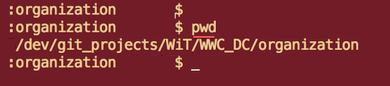   
#### Step 2
Run `git pull`. This is VERY important to make sure that you have the changes from other users. If you don't run this often enough, you will probably end up with a merge conflict later one - which will mean your additions won't be added   
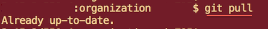
#### Step 3
`git status` will show you what files you have changed, just to do a sanity check.   
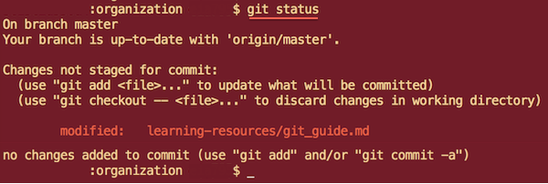
#### Step 4
When you run `git add` - make sure you specify exactly what files you want to add. You don't want to add anything strange to the repo! Then do `git commit` to stage the files   
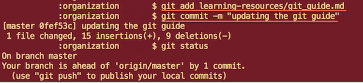
#### Step 5
Double check that your remote leads to your public repo on github (that you forked from womenwhocodedc)   
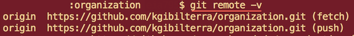
#### Step 6
Now you can push your changes!   
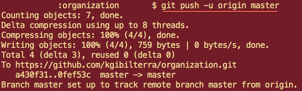
#### Step 7
This is where it gets a little confusing. You are going to see your changes in your own personal github profile.   
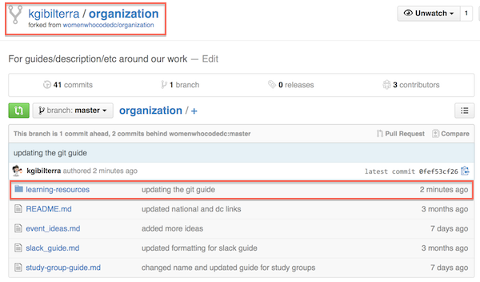
#### Step 8
NOT the womenwhocodedc github profile.   
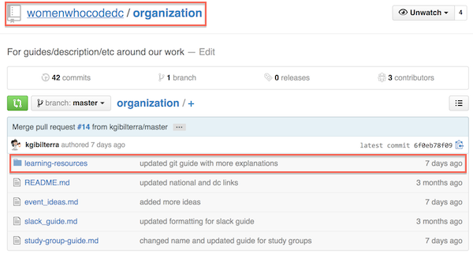
#### Step 9
When you are in *your* github profile, click the Pull Requests tab on the right.   

#### Step 10
Click the green new pull request.   
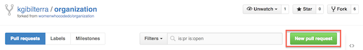
#### Step 11
Review your changes! They will show up below, so scroll through to be sure that your changes are what you want.   
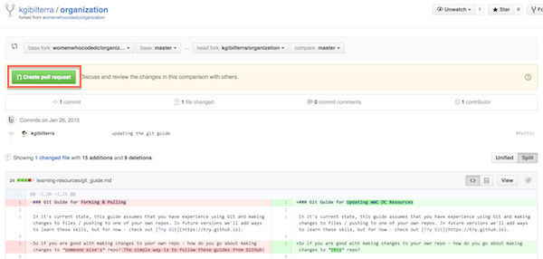
#### Step 12
Now you can leave any additional comments before officially submitting the pull request.   
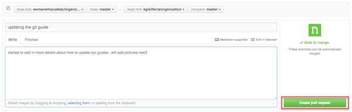
#### Step 13
And you are done! Congrats! One of the github owners should review the pull request and add it if it is good. If the pull request is not accepted, it is most likely because there was a merge conflict.   
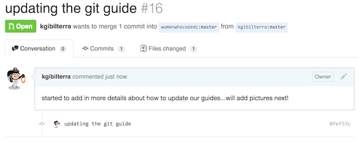

